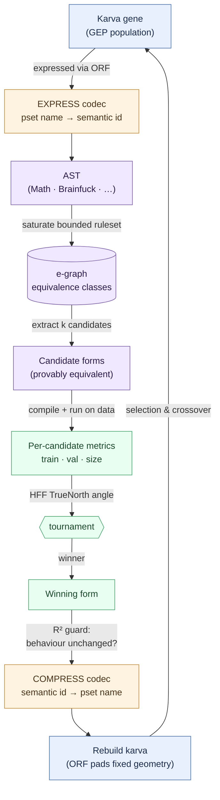

# fuller

**An e-graph engine for making symbolic expressions smaller — provably without changing what they compute.**

Named after Buckminster Fuller's *ephemeralization*: doing more with less. `fuller`
takes a symbolic expression (a GEP chromosome, a SymPy expression, a Brainfuck
program) into an [egglog](https://github.com/egraphs-good/egglog) e-graph,
saturates a bounded ruleset, and extracts the smallest equivalent form — with a
data-gated or exact equivalence check so a rewrite can never silently change
behaviour.

It is a Rust crate exposed to Python via [PyO3](https://github.com/PyO3/pyo3).
It was built to replace SymPy on the hot path of a symbolic-regression engine
(the [HFF](https://github.com/Gamakon/HFF) equation-recovery work), where
SymPy's complex-domain assumptions, native signal handling, and exponential
simplification paths made expression cleanup unreliable. egglog is
the right substrate: deterministic, bounded, declarative, and fast (the same
engine family behind [Herbie](https://herbie.uwplse.org/)).

## The vision

**Machine-discovered expressions should be reported in their simplest form.**
Physical laws are compact; expressions produced by evolutionary search are
not. They arrive with constants absorbed into coefficients (`√(NA/r⁴)`
concealing a physical constant), redundant structure, and noise terms that fit
the sample rather than the underlying relationship. Much of the gap between an
expression that fits the data and the law itself is this excess structure.
fuller reduces it — Buckminster Fuller's ephemeralization, *doing more with
less*, applied to equations.

**Representation should be evolvable.** A constant can appear in a genome two
ways: as a symbol (`pi`, `G`, `k_e`) or as a number (`3.14159…`, `6.674e-11`).
The `snap` ⇄ `concretize` pair makes that choice a reversible mutation, so a
population carries both representations and selection determines which
survives. When the symbolic form wins, the discovered expression matches the
reference form directly rather than being recovered by post-hoc pattern
matching.

**Rewriting belongs inside the evolutionary loop, not after it.** Classical GP
treats simplification as post-processing, because unsound rewrites inside the
loop would corrupt the population. fuller's rewrites are proved equivalent (or
data-gated to preserve behaviour), which removes that constraint: denoise,
snap, and physics-prior restructuring can act as genetic operators, and a
simplification, once found, is propagated by crossover — a Lamarckian
mechanism made sound by proof of equivalence.

**Any grammar with a cost model and an equivalence check can be minimised.**
Symbolic regression checks equivalence against data; Brainfuck checks it
exactly, output-by-output. The engine is agnostic to the choice, and both
targets ship to demonstrate it. The same machinery applies to SQL, regex,
sorting networks, or compiler IR — any setting where a smaller, provably
equivalent program is useful.

## How it works — the round trip

A karva gene leaves the GEP population, is rewritten in an e-graph under
proved-equivalence rules, evaluated on data, and returns to the population as
a valid gene:



**Blue** is the GEP domain (geppy genes), **purple** the e-graph domain (every
rewrite provably equivalent), **green** the data domain (candidate behaviour
measured on held data). Step by step:

| # | Stage | Operation | What happens / why it works |
|---|---|---|---|
| 1 | **Karva gene** (fixed head+tail token string) | expressed via the ORF | GEP decoding reads tokens until the expression tree closes — the open reading frame. Everything past the ORF is non-coding and silent. |
| 2 | Math AST | saturate bounded ruleset | The expressed tree is lifted into an egglog e-graph and a capped rewrite schedule runs — deterministic and bounded. |
| 3 | E-graph (equivalence classes) | extract k candidates | The e-graph holds every equivalent form compactly in shared classes; only k variants are materialised. Each is provably equivalent by construction. |
| 4 | Candidate forms | compile + run on data | Each candidate is compiled and evaluated on train/val rows; behaviour is measured directly. |
| 5 | Per-candidate metrics (train · val · size) | HFF TrueNorth angle | Each candidate's metric vector becomes one angular fitness score, using the same scoring geometry as the host GA. |
| 6 | Scores | tournament | Candidates compete; the instrumented e-class tournament selects the winner on measured behaviour rather than the cost model alone. |
| 7 | Winning form | R² guard | The winner is retained only if behaviour on the data is unchanged within tolerance; a rewrite cannot silently change what the gene computes. |
| 8 | Rebuilt karva tokens | re-encode into the fixed head/tail geometry | **This step is only sound in karva, because of the ORF.** A simplified form is usually *shorter* than the gene it replaces — in tree-GP that is a differently-shaped genome and breaks the genetic operators. In karva the shorter coding region ends earlier; the fixed-length head and tail are padded with terminals *past the ORF*, which are non-coding by definition, so the padding cannot change the expressed tree. The rebuilt gene is a structural drop-in of identical length. |
| 9 | **Karva gene** (back in the population) | selection & crossover | The simplification is now heritable: crossover propagates it and selection judges it. Rewriting operates inside the loop rather than as post-processing. |

The open reading frame serves two purposes here: it allows any equivalent
form — shorter, restructured, constant-snapped — to re-enter a fixed-geometry
genome legally, and it guarantees the padding is inert (non-coding by
definition). Without it, step 8 would require variable-length genomes, and
rewriting would revert to a post-processing step.

The same cycle applies to **Brainfuck** programs. The middle of the loop
(steps 2–7) is target-agnostic — swap the grammar and the cost model — with
one difference: because a Brainfuck program's behaviour is a decidable
input→output function, the equivalence guard at step 7 is exact rather than
statistical. `bf_simplify` implements that path, and any target with decidable
equivalence (SQL, regex, compiler IR) fits the same cycle.

### The symbol-table contract (the two codecs)

The soundness of the round trip depends on the two codec steps (orange nodes).
fuller does not hardcode a symbol table — the host declares one, and the two
codecs enforce it in both directions:

**EXPRESS** (gene → AST): the host supplies each karva call with a mapping
from its own token names to fuller's semantic ids,

```python
functions = {                     # token_name -> (semantic_id, arity)
    "protected_div_zero": ("protected_div", 2),
    "_pset_square":       ("pow2", 1),
    "_raw_div":           ("div", 2),
    ...
}
```

so the e-graph reasons over semantic ids (`div`, `pow2`), independent of the
host's naming. Distinct semantics remain distinct: a protected division and a
raw division map to different ids, so no rule can substitute one for the
other.

**COMPRESS** (winning form → gene): every candidate fuller emits is rendered
using only token names from that same mapping, so decoding back into the
host's pset always resolves. Any form the host's symbol table cannot express
is reported in the `inexpressible` field of the result rather than
approximated. The host's decode tables may also be a superset of what its GA
samples (decode-only registration), which keeps raw operators available to
rewrites without entering random gene generation.

See [`docs/USAGE.md`](docs/USAGE.md) for the full contract.

## What it does

- **Denoise** — shrink an expression to an equivalent smaller one, gated by an
  R² check against your data so the rewrite provably preserves behaviour on the
  points you care about.
- **Snap ⇄ concretize** — flip named constants (`pi`, `G`, `k_e`, …) to their
  numeric values and back. The pair works as GEP mutation operators, letting a
  population evolve the *representation* (symbolic vs numeric) under selection.
- **Prove equivalence** — `equals` / `proves_equal` decide whether two
  expressions are the same via equality saturation, not sampling.
- **SymPy bridge** — `to_math` / `from_math` convert SymPy ⇄ the internal `Math`
  form losslessly (real-domain ops), so you can drop `fuller` into a SymPy
  pipeline.
- **Brainfuck simplifier** — the same machinery applied to a second, exact
  target (`bf_simplify`), where equivalence is decidable output-by-output.

## Install

Requires a Rust toolchain (`rustup install stable`) and Python ≥ 3.9. Built with
[maturin](https://github.com/PyO3/maturin):

```bash
pip install maturin
maturin develop --release      # builds the Rust extension and installs `fuller`
```

## Quick start

```python
import sympy as sp
import fuller

r = sp.Symbol("r")

# SymPy <-> internal Math form
fuller.to_math(sp.pi * r**2)          # '(Mul (Var "pi") (Pow2 (Var "r")))'

# Prove two forms equal (equality saturation, not sampling)
fuller.equals(sp.pi * r**2, sp.pi * r * r)     # True

# Denoise a Math expression against data: shrink it while preserving R².
rows = [{"x": v} for v in (-2.0, 1.0, 3.0, 5.0)]
fuller.denoise('(Add (Mul (Var "x") (Num 1.0)) (Mul (Num 0.0) (Var "y")))', rows)
# -> {'expr': '(Var "x")', 'cost': 1, 'changed': True}

# Same engine, a different target: simplify a Brainfuck program.
fuller.bf_simplify("+++[-]")     # {'source': '...', 'op_count': ..., 'changed': ...}
```

For the GEP/karva-chromosome API (`denoise_karva`, `snap_karva`,
`concretize_karva`, `physics_mutate_karva`, `eclass_extract_hff_instrumented`),
see [`docs/USAGE.md`](docs/USAGE.md).

## Two proven targets: symbolic regression and Brainfuck

fuller is not tied to one language. The core is *target-agnostic*: give it a
grammar, a cost model, and a way to check equivalence, and it will minimise
programs in that grammar. Two targets ship, chosen because they check
equivalence in the two fundamentally different ways available:

**Symbolic regression (equivalence checked against data).** Evolved GEP
expressions are noisy and bloated — `x·1 + 0·y`, `√(NA/r⁴)·…` where a physical
constant is absorbed into a coefficient, `Abs(a^1.5)` where the domain is
positive. fuller folds these to the reduced form (`x`, `1/r²·√NA`, `a^1.5`) and
keeps the rewrite **only if R² does not drop on your data**. This is the hot
path it was built for: replacing SymPy inside a symbolic-regression engine's
extraction step, cheaply and deterministically, so the discovered expression is
reported in its simplest equivalent form. The `snap_karva` / `concretize_karva`
pair goes further — letting a population evolve *whether a constant is symbolic
or numeric*, so selection recovers the reference form of a law in a single run.

**Brainfuck (equivalence checked exactly).** A Brainfuck program's behaviour is
a decidable input→output function, so equivalence is *exact* — no data, no
tolerance. `bf_simplify` collapses run-length redundancy (`+++++-----` → nothing,
`[-]` clear-loops) while proving the simplified program produces identical output
on every input. It demonstrates the same engine in the setting where behaviour
preservation is decided exactly rather than statistically — and the same
technique applies to any target with decidable equivalence (SQL, regex, sorting
networks, compiler IR).

## Python API

| Function | Purpose |
|---|---|
| `denoise(expr, rows, tolerance=, k_variants=, positive_vars=, nonzero_vars=)` | Shrink a `Math` string, R²-gated against `rows`. |
| `denoise_karva(head, tail, …)` | Same, as a GEP mutation operator on karva head/tail token lists. |
| `snap_karva(head, tail, …)` | Up-flip: replace fitted numbers with named lattice constants. |
| `concretize_karva(head, tail)` | Down-flip: replace named constants with their numeric values. |
| `equals(a, b)` / `proves_equal(a, b, …)` | Decide equivalence by equality saturation. |
| `to_math(expr)` / `from_math(s)` | SymPy ⇄ `Math` s-expression bridge. |
| `physics_mutate_karva(…)` | Physics-prior structural mutations (inverse-square, etc.). |
| `eclass_extract_hff_instrumented(…)` | Tournament extraction with per-variant metrics. |
| `bf_simplify(source)` / `bf_parse` / `bf_unparse` | Brainfuck program simplification. |
| `master_constants()` / `master_lattice()` / `master_pset()` | The constant lattice and primitive set. |

## Why an e-graph instead of SymPy

SymPy rewrites in place, over the complex domain, with simplification paths that
can blow up on adversarial input and native code that installs its own signal
handlers. On a hot evolutionary loop that is both slow and unreliable. An
e-graph represents *all* equivalent forms at once, applies a **bounded**
ruleset (saturation is capped), extracts by an explicit cost
model, and is fully deterministic — the same input always yields the same
output. Equivalence is *proved* by saturation, not sampled.

## Design guarantees

- **Bounded.** Every saturation runs a capped rule schedule; no unbounded work.
- **Behaviour-preserving.** Rewrites are either exact (algebraic identities) or
  data-gated (kept only if R² does not drop) — a rewrite cannot silently change
  what an expression computes.
- **Deterministic.** No wall-clock, no randomness outside an explicit `rng_seed`.
- **Crash-safe at the boundary.** PyO3 entry points return `Err`, never abort:
  deeply nested / oversized inputs are rejected rather than overflowing the
  stack.

## Status

Core is working and used in production by a symbolic-regression engine: denoise,
the snap/concretize flip pair, the physics-prior mutations, the SymPy bridge,
and the Brainfuck simplifier all ship. The ruleset is deliberately small and
grows conservatively — a rule lands only once it is either provably sound or
data-gated. See [`docs/USAGE.md`](docs/USAGE.md) for the consumer guide and
`docs/` for per-feature notes.

## Citation

fuller is the rewrite substrate of the [HFF](https://github.com/Gamakon/HFF)
symbolic-regression engine. If you use it in published research, please cite
the GECCO 2026 poster:

```bibtex
@inproceedings{morgan2026hff,
  author    = {Andrew James Morgan},
  title     = {Hyperspherical Fitness Functions for Many-Objective Optimization},
  booktitle = {Proceedings of the Genetic and Evolutionary Computation
               Conference Companion (GECCO Companion '26)},
  series    = {GECCO Companion '26},
  year      = {2026},
  month     = jul,
  location  = {San Jose, Costa Rica},
  publisher = {ACM},
  address   = {New York, NY, USA},
  isbn      = {979-8-4007-2488-6/2026/07},
  doi       = {10.1145/3795101.3805445}
}
```

## License

MIT. See [`LICENSE`](LICENSE).

---

Built by [Gamakon](https://gamakon.ai). Support, integration help, and
collaboration enquiries are welcome — reach out via [gamakon.ai](https://gamakon.ai).
