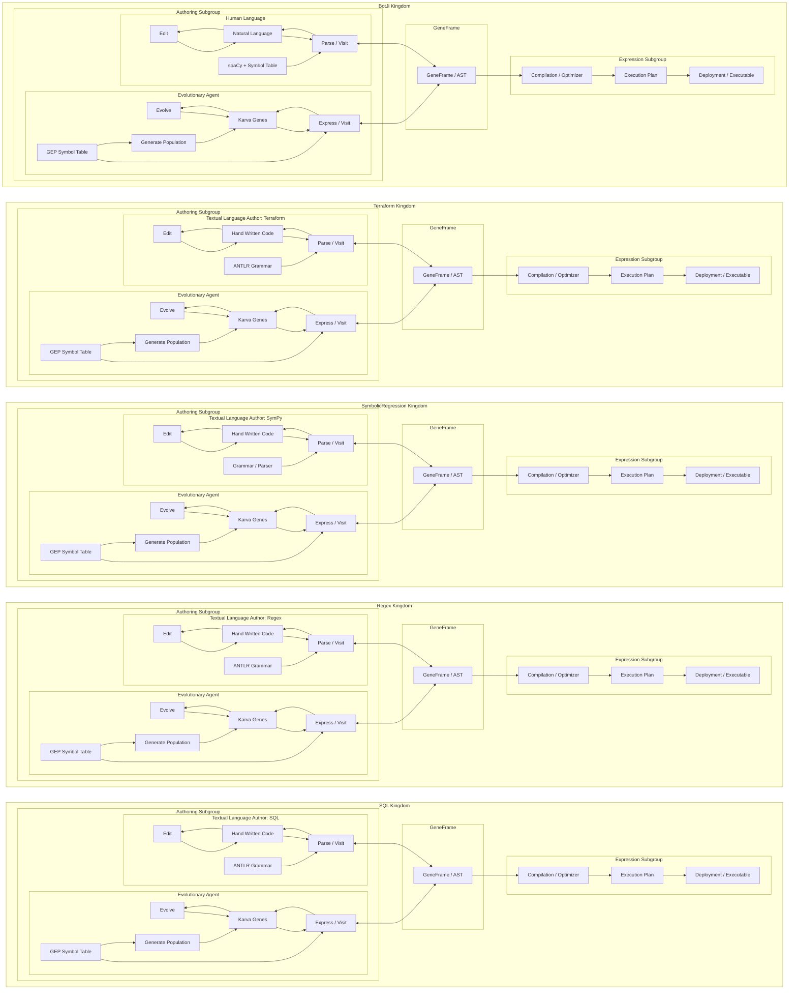

# Kingdom Matrix Architecture

The core architectural diagram for the nucleotable / GeneFrame system.

Each **Kingdom** is a row. Each row has three subgroups:
- **Authoring Subgroup** (left): two paths into GeneFrame — a human language author and an evolutionary agent
- **GeneFrame** (centre): the shared canonical document artefact — NOT part of any authoring lane
- **Expression Subgroup** (right): Compilation → Heuristic Optimisation → Deployment

All arrows between Authoring and GeneFrame are **bidirectional** — the human reads back from GeneFrame, and the evolutionary agent reads back to assess fitness.

The **BotJi Kingdom** is the only row where the human authoring path is labelled **"Human Language"** rather than "Textual Language Author" — because natural language has no formal grammar to author.

---

## Mermaid diagram (full internals, paper-quality)

---

## The central claim

> Any language that humans write, which resolves to an AST, can also be written by GEP — provided the symbol table enforces correctly typed arities.

Multi-typed GEP with correct arity constraints **cannot construct invalid ASTs**. The evolutionary path is therefore structurally equivalent to the human path, and both converge to the same GeneFrame artefact.

Each new Kingdom requires only:
1. A symbol table (typed GEP symbols with input/output signatures)
2. A grammar / parser (for the human authoring path)
3. An expression subgroup (domain-specific compilation/deployment)

Everything else — the GeneFrame schema, the evolutionary loop, the fitness infrastructure — is shared.

---

## Compact summary table

| Kingdom | Human Author | Grammar / Parser | GeneFrame artifact | Expression target |
|---------|-------------|------------------|--------------------|-------------------|
| SQL | SQL text | ANTLR | Query AST | Optimizer → Execution Plan → DB |
| Regex | Regex pattern | ANTLR | Regex AST | Compiler → Automaton → Matcher |
| SymbolicRegression | SymPy expression | SymPy parser | Expression tree | Simplify → Evaluate |
| Terraform | HCL config | ANTLR | IR | Planner → Dep graph → Apply |
| **BotJi** | **Natural language** | **spaCy + Symbol Table** | **Phylo GeneFrame** | **Compress → Transmit → Decode** |
